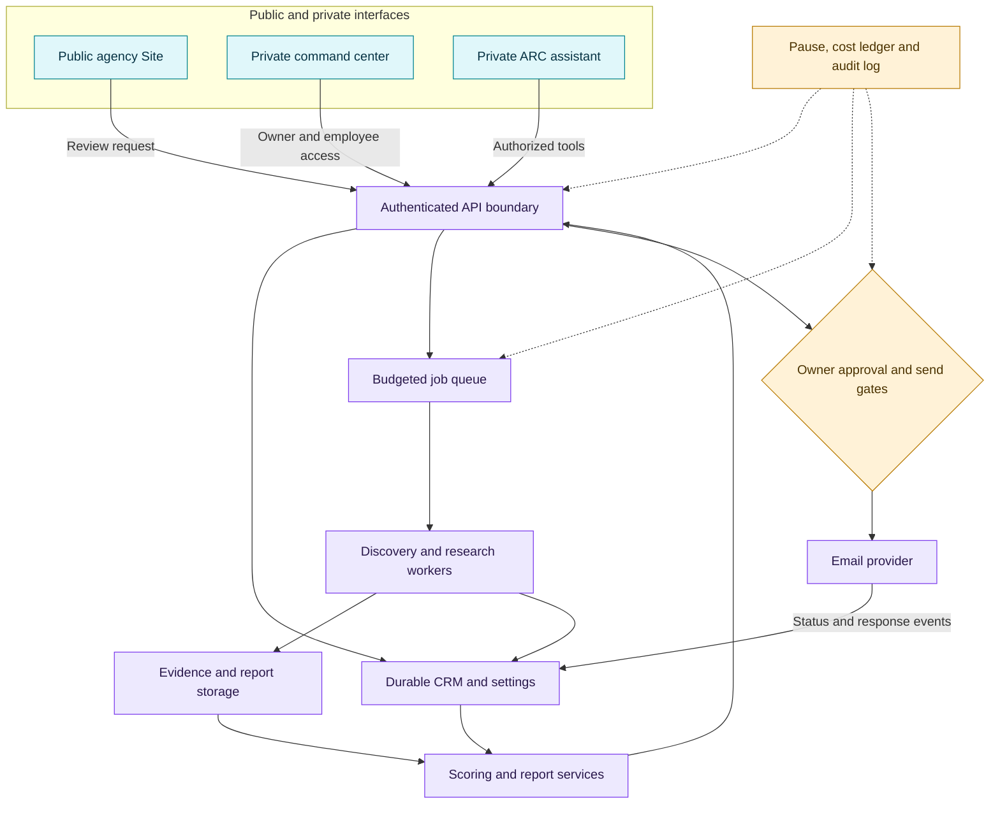
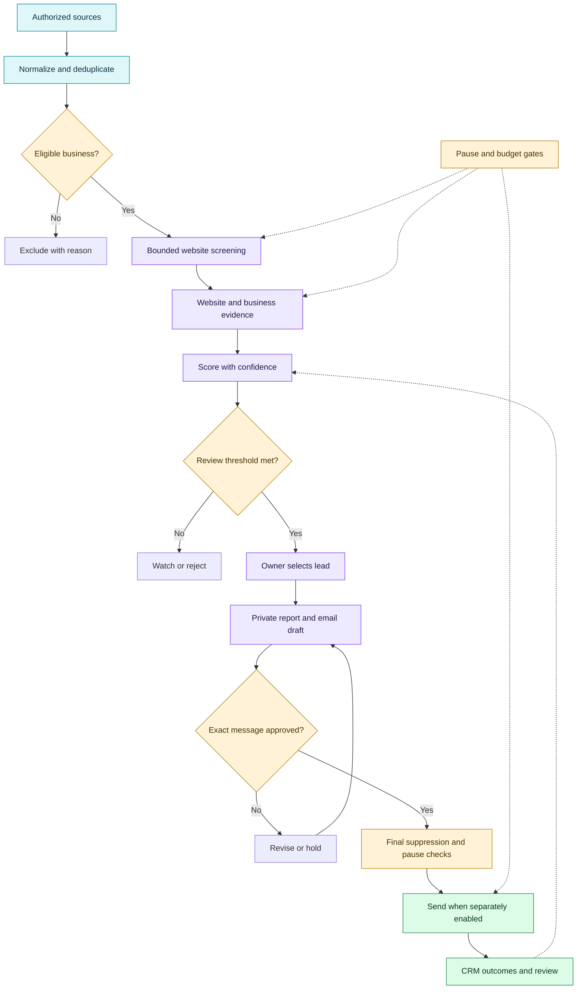
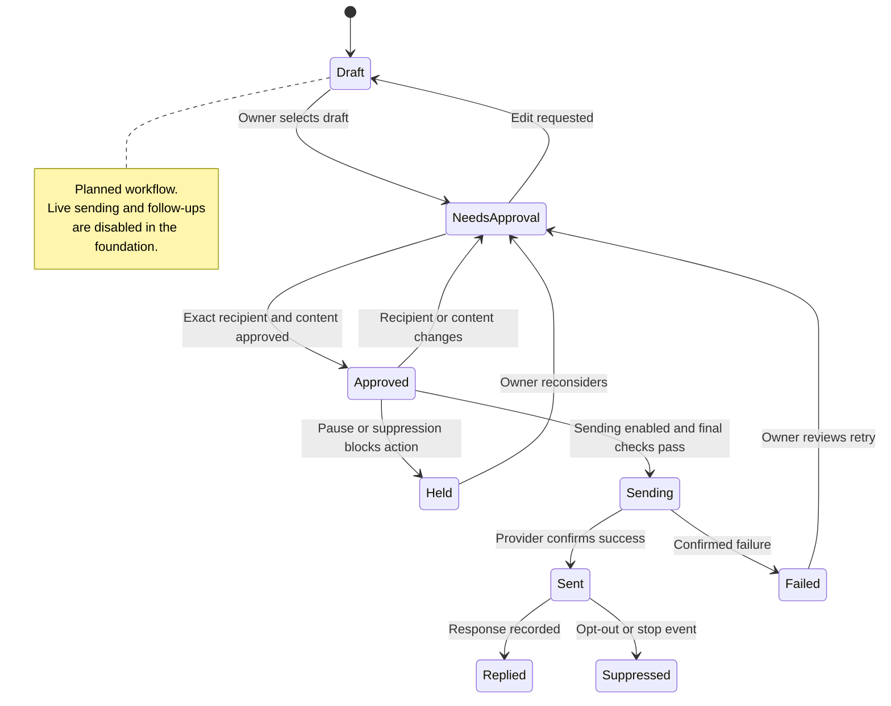

# ARC architecture and data flow

**Proposed design | Foundation configured PAUSED | October 9, 2026**

These diagrams depict intended relationships, not a deployed production environment. The complete foundation is the private instruction/context package; Site, backend, workers, CRM and providers remain pending.

## System architecture

Public and private interfaces share an authenticated API. Durable state belongs in the backend; authorized assistant tools read and change the same records used by the command center.

## Research-to-outcome flow

Candidates pass eligibility, bounded screening and evidence-based scoring. Owner selection precedes reports/drafts. Approval, pause, budget and suppression controls are separate from score thresholds.

## Message approval lifecycle

This is the planned send lifecycle. The foundation has no sending integration. A score, draft or report never grants permission to send.

## Data contracts at a public level

| Artifact | Contains | Consumed by |
| --- | --- | --- |
| Candidate | Business identity, canonical domain and provenance | Eligibility and deduplication |
| Evidence | Observed value, source, page, time, confidence and context | Audits, scoring, reports and drafts |
| Score snapshot | Dimension values, weights, version and explanation | Ranking and owner review |
| Private report | Selected verified findings, coverage and recommendations | Prospect review after owner selection |
| Approval | Exact recipient/content, owner action and validity state | Final action gate |
| Usage record | Reserved/actual provider cost and job context | Budget enforcement and review |
| CRM event | Observed stage, response, proposal or deal outcome | Attribution and later calibration |

## Trust boundaries

The public showcase contains project explanations. The private workspace contains leads and approvals. Provider access is server-authorized and budgeted. External website text is research input, not operational instruction. Prospect reports remain private and revocable. These controls require implementation and verification before production use.
