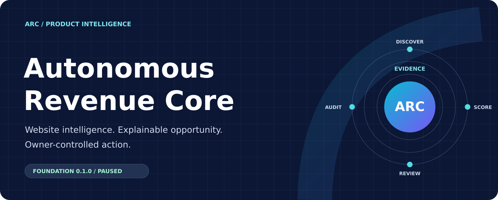
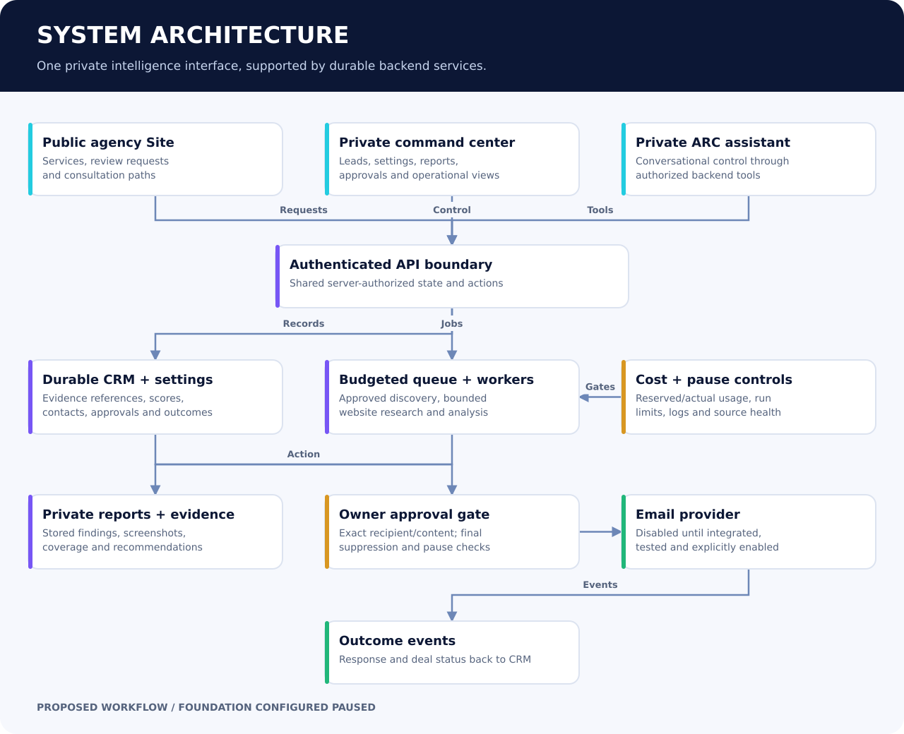
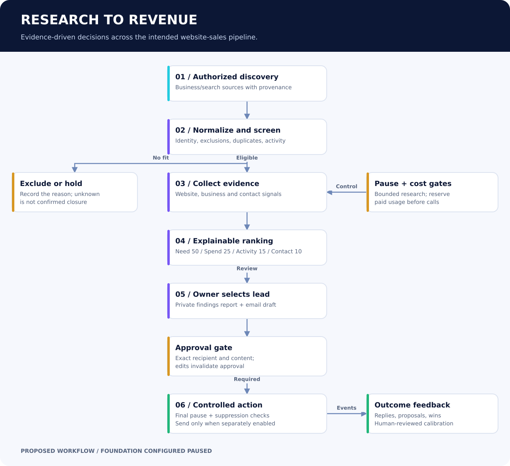
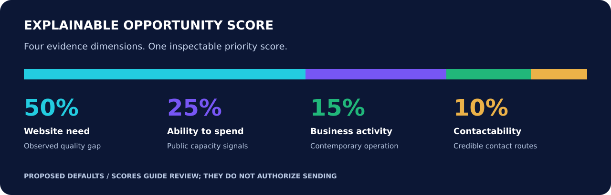

# Autonomous Revenue Core

## Public product-development case study

**Created by Derek Kupsky | October 9, 2026 | Foundation 0.1.0 | Configured PAUSED**

ARC is in development. Unless explicitly marked as complete, capabilities below describe the intended system. No customer or revenue results are claimed.

## 01. Executive overview

**Evidence before outreach.**

### The product

Autonomous Revenue Core (ARC) is a website-sales intelligence platform in development. Its design connects business discovery, website analysis, opportunity scoring, personalized reports and owner-approved outreach through one private AI interface.

### The problem

A neglected website is only one part of a sales opportunity. The business must also be active, fit the service offering and have a credible contact route. Manual research spreads those decisions across search results, screenshots, spreadsheets and email drafts.

### The approach

ARC is designed to turn permitted public information into a traceable lead dossier. The same evidence supports the score, private audit report, outreach draft and CRM record. Research depth increases only when a prospect warrants the additional cost.

### Current stage

The initial private plugin foundation is complete and configured PAUSED. It contains the project context, operating rules and build specifications. The production research backend, Site, CRM, workers and sending integration remain pending. This is a product-development case study, with no claimed customer or revenue results.

## 02. Product strategy

**A focused path to first revenue.**

### Initial customer profile

Active smaller businesses with weak or neglected websites: professional services, construction and specialist trades. Typical size is 1-100 employees; sole proprietors are eligible. Website work can be delivered worldwide, with configurable geographic targeting.

### Scope discipline

Version 1 researches website-sales opportunities. Microsoft 365, MSP and general IT prospecting are outside that research scope. IT services may appear in future agency marketing, but they contribute no points to the V1 lead score.

### Commercial entry point

The planned offer combines a complimentary website review, a private findings page and a consultation. An eligible simple site of approximately five basic pages may qualify for a $500 offer. Commerce, complex integrations, portals and large migrations require separate quotes.

### Why focus matters

A narrow service, defined customer profile and measurable outcome make the first experiment easier to evaluate. Expansion follows credible response and revenue evidence, rather than activity counts alone.

## 03. System architecture

**One interface. Durable operational state.**

### Public experience

A premium agency Site is planned to explain services, capture review requests and present clear consultation and offer paths. It is separate from the employee workspace and private prospect reports.

### Private workspace

The command center is planned to expose leads, evidence, scores, reports, drafts, approvals, CRM stages, costs, source health and run controls. Ask ARC provides a conversational interface to the same authorized operational state.

### Backend responsibility

An authenticated API, durable database, job queue, isolated research workers and report storage form the proposed operating system. The assistant calls authorized tools; it does not replace the database or run continuous work merely because a plugin exists.

### Shared truth

Portal and assistant reads are intended to use the same backend records. Settings, approvals, evidence, score versions and provider usage persist outside conversation memory. The architecture is proposed; these services are not deployed by the foundation release.

## 04. Research data flow

**Progressive research with visible decisions.**

### Discover and normalize

Authorized business/search sources produce candidates with provenance. Canonical domains and identity signals support deduplication before deeper work.

### Screen and verify

Industry, size, closure, franchise, suppression and duplicate checks eliminate clearly unsuitable candidates. A bounded homepage/service/contact review produces initial signals. Unknown evidence remains unknown.

### Audit and rank

Selected candidates receive broader website, business and contact analysis. Page observations, screenshots, measurement context and source timestamps feed four explainable scoring dimensions. Thresholds guide review; a high score never authorizes a send.

### Select, report and learn

The owner selects a prospect. ARC is designed to reuse stored research for a private report and short email draft. Exact-message approval and final action gates precede any enabled sending. Responses, rejections, proposals and wins feed a later human-reviewed calibration loop.

## 05. Research scope

**What ARC is designed to examine.**

### Six research families

The public research catalog describes 63 criteria across eligibility, website design, performance/SEO/conversion, site structure, business signals and contact/action readiness. These are intended criteria, not a claim that all checks execute today.

### Evidence over labels

A useful finding includes the observed issue, affected page, source, timestamp, device or test conditions, confidence and recommendation. "Outdated" becomes an explainable judgment rather than a vague label.

### Coverage matters

A three-page screen is different from a deep crawl. The proposed defaults permit up to three screening pages and up to 120 deep-crawl pages, within tighter time, access and cost constraints. Reports disclose visited, discovered, blocked and failed pages.

### Boundaries

A quiet blog, old copyright, generic email, absent social profile, CMS brand or designer footer is not enough to reject a business. Observed website issues must be distinguished from guesses about the owner, finances or maintenance history.

## 06. Explainable opportunity scoring

**A transparent model for prioritization.**

### Four dimensions

Score = 0.50 x website need + 0.25 x ability to spend + 0.15 x business activity + 0.10 x contactability. Every dimension uses a 0-100 scale. A higher website-need score means a larger observed quality gap.

### Website need detail

Within website need, the initial subweights are visual/design 30%, mobile usability 15%, content freshness 12%, conversion 15%, performance 10%, SEO 10% and branding 8%. These weights total 100% of the website-need dimension, not the overall score.

### Review thresholds

70+ enters dashboard qualification; 80+ receives deep-research preference; 90+ is the initial outreach-review focus. All thresholds are proposed configurable defaults. Eligibility, confidence, owner selection and message approval remain separate gates.

### Confidence and history

Public ads, hiring, offices and project activity are capacity proxies, not verified bank balances or intent to buy. Scores retain explanatory evidence, unknowns, feature snapshots and a model version so later changes do not erase the original decision.

## 07. Illustrative lead walkthrough

**A demonstration, clearly labeled.**

### Synthetic example

Example Services is a fictional firm used only to explain the model. No real website was crawled and no contact was researched. Assume website need 92, spending signals 82, business activity 90 and contactability 85.

### Calculation

46.00 + 20.50 + 13.50 + 8.50 = 88.50 out of 100. The example clears the dashboard threshold and deep-research preference, but falls below the 90+ initial outreach-review focus.

### Interpretation

A score of 88.50 is a prioritization output, not an 88.50% probability of conversion. The owner should examine the evidence and uncertainty before deciding whether more research is justified.

### Decision discipline

A report or draft can be prepared from supplied evidence without contacting anyone. Neither the score nor a completed draft triggers a send. The synthetic example is not a pilot result, customer case or proof of operating performance.

## 08. Private command center

**Designed for inspection and control.**

### Lead workspace

A ranked list and lead detail view are planned to show identity, site inventory, screenshots, scoring dimensions, confidence, contacts, exclusions and research history. Rejection reasons remain visible.

### Operational control

The planned settings area covers markets, industries, source selection, weights, thresholds, crawl scope, daily limits, spending and pause state. The cost view separates reserved exposure from actual recorded usage.

### Workflow and CRM

Reports and drafts link to their evidence. Owner approvals identify the exact recipient/content. CRM tracks research, selection, messages, replies, meetings, proposals and outcomes. Revenue and recurring value are recorded when known.

### Honest interface

Live values must come from backend records; synthetic demonstrations must be labeled. Connection failures, unknown values and blocked actions need visible states. Authentication, MFA, roles and audit logs are design requirements, not completed portal features.

## 09. Prospect experience

**A personalized review with a clear next step.**

### Private findings page

For an owner-selected prospect, a report is planned to include a tailored overview, desktop/mobile evidence, scoped measurements, website map, page/media inventory and prioritized recommendations.

### Practical recommendations

Each finding connects an observed issue to an affected page and a proposed improvement. Priority and effort bands help separate urgent work from optional polish. Measured values retain their URL, device and timestamp.

### Controlled access

Prospect reports are planned as private, revocable pages with optional PDF export, independent from the public project showcase. Their content and contact details do not belong in this repository.

### Outreach draft

The intended first email is approximately 80-120 words, grounded in verified findings and an honest consultation/report invitation. It may mention the simple-site offer only where scope fits. No invented visits, relationships, review time, employees or testimonials.

## 10. Action governance

**Approval is a product feature.**

### Pause by default

The saved initial release is configured PAUSED. Research, schedules, live sending and automatic follow-ups are disabled, and no autonomous runtime is provisioned by that release. This document does not assert the state of unrelated account systems.

### Approval boundaries

Every initial email requires the owner's explicit approval of the actual recipient and content. Edits invalidate approval. Final suppression, pause and sending-enable checks precede any provider call in the proposed workflow.

### Evidence and access

Source authorization, bounded public-site research, provider retention requirements and privacy controls are planned into the data path. No automated submission to prospect forms or intrusive vulnerability scanning is part of the website review.

### Calibration control

Feedback from replies, won/lost deals and rejection reasons can inform later scoring review. Changes are intended to be reviewed against meaningful evidence, versioned and reproducible; one opinion does not silently retrain the system.

## 11. Economics and operating limits

**Designed for a bounded first experiment.**

### Pilot envelope

Proposed initial limits are at most 100 raw candidates per day, a target of five qualified leads and a hard $10 daily paid research/API budget including model calls. These are caps and goals, not achieved output or committed spending.

### Cost reservation

The backend is designed to reserve estimated provider cost before a paid call, reconcile actual usage and stop admitting paid work when the budget would be exceeded. Candidate and qualified-lead limits also stop additional intake at their boundary.

### Efficient depth

Cheap screening precedes deep audits. Research evidence is reused for ranking, reports and drafts. A proposed per-report research ceiling of $1.50 is subordinate to the daily budget, and no daily quota is filled with invented leads.

### Economic honesty

The $10 limit covers the specified paid research/API envelope; it is not a claim that hosting, database, email, labor or the whole business costs $10 per day. The $500 offer is a scoped service proposal, not proven revenue or profit.

## 12. Build roadmap

**From foundation to a measured pilot.**

### Foundation - complete

The initial private plugin package, project context, operating instructions and paused configuration are saved. Public project documentation presents the product without exposing proprietary build material.

### Next - backend and Site

Implement durable data, authentication, queue/workers, settings, budget ledger and command center. Connect Site and assistant tools to the same backend while keeping research and sends disabled. Confirm actual reads and pause behavior.

### Then - pipeline and dry run

Validate discovery, bounded crawling, evidence storage, scoring, private reports, draft approval and provider sandbox behavior. Demonstrate errors, caps and suppression with labeled test data before live operation.

### Pilot - separate activation

Only after integration checks and explicit owner activation should a bounded live research experiment run. Review actual cost and lead quality. Initial emails remain individually approved; follow-ups remain disabled. Expansion follows measured response and revenue evidence.

## 13. Measurement and limitations

**Success must be observable.**

### Quality metrics

Track eligible candidates, evidence coverage, confidence, owner acceptance/rejection reasons, contact quality and report corrections. Missing or conflicting evidence should be visible rather than averaged away.

### Commercial metrics

When a pilot exists, track delivered approved emails, positive replies, consultations, proposals, wins, attributable revenue and recurring value. Define denominators and date windows before comparing runs.

### Cost and control metrics

Measure reserved versus actual provider usage, paid cost per qualified lead, report cost, full acquisition cost where known, pause behavior and suppression/approval enforcement. Research API cost alone is not customer-acquisition cost.

### Current evidence limit

No production pipeline, live leads, conversion rate, customer count, revenue result or ROI is established by this foundation. Public proxies are imperfect, automated audits have coverage limits and global source availability varies. This case study documents the product strategy and intended engineering, with the foundation stage clearly identified.

## Current capability status

| Component | Stage | Meaning |
| --- | --- | --- |
| Private ARC plugin foundation | COMPLETE | Saved instructions, context and paused defaults. |
| Autonomous research runtime | NOT IMPLEMENTED | No worker or scheduler provisioned by this release. |
| Site and live backend connection | PENDING | Integration and shared-state checks required. |
| CRM, private portal and report engine | PLANNED | Architecture and workflow specified. |
| Live prospect discovery and audits | DISABLED | Requires backend and separate activation. |
| Live email sending | DISABLED | Exact-message approval and tested integration required. |
| Automatic follow-ups | DISABLED | Outside the initial pilot behavior. |
| Customer/revenue performance | NOT ESTABLISHED | No live pilot results claimed. |

## Explore the project

- [Product launch announcement](PRODUCT_LAUNCH.md)
- [Research parameter catalog](RESEARCH_PARAMETERS.md)
- [Architecture and data-flow diagrams](ARCHITECTURE.md)
- [Release status and measurement plan](STATUS_AND_ROADMAP.md)

## Evidence basis

This public overview is an editorial synthesis of the owner-supplied project blueprint and the saved foundation release record reviewed on October 9, 2026. Those private records define intent and foundation configuration; they do not establish live backend behavior. The fictional worked example is illustrative. Proprietary instructions, full build documents, private conversation content, credentials and prospect data are not included.
